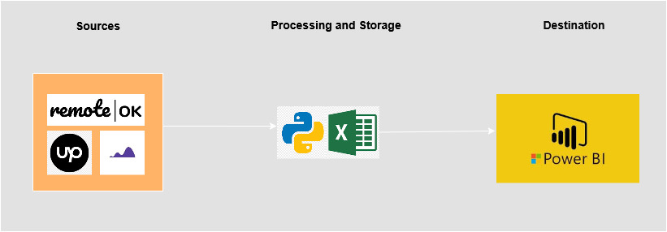

# Remote Jobs Scraper Project 

> Data Flow Diagram

## Introduction

Due to the worsening condition of Nigeria&#39;s economy, there has been a significant increase in the demand for foreign remote jobs, enabling Nigerians to earn in foreign currency. This shift has driven many to acquire new tech skills in order to compete in the global job market.

For this project, I collected datasets from three sources, **RemoteOK**, **Himalayas**, and **Upwork**. to identify the most in-demand skills from remote job offers. The focus was on the Worldwide category, as there are very few foreign remote job postings targeted exclusively at Nigerian applicants.

## Data Scarping 
The data scraping process was carried out using the following Python packages:
- RemoteOK →  ***Scrapy***
- Himalayas → ***Playwright***
- Upwork → ***no driver & Playwright***

## Data Processing and Storage 

After extracting, each dataset was stored in a CSV file, and **_Pandas_** was used for cleaning and data manipulation.
- Job roles and tags were used to group job posts into categories.
- Duplicates and rows with empty entries in key columns were removed.
- The three cleaned datasets were merged into an Excel workbook with three sheets using Excel Macros.
- The merged dataset was then loaded into Power BI for analysis.

## Date Analysis

The datasets were analyzed to determine  the most in-demand skills overall and the most in-demand skills by experience level (entry, intermediate, and expert) among others

[**PowerBi Link**](https://app.powerbi.com/reportEmbed?reportId=9833a8e7-9e3c-434b-b24f-2915d21dfd55&autoAuth=true&ctid=5fe78ac1-1afe-4009-aa04-a71efb4a5042)

This link contains the visualizations and dashboards created from the dataset, showcasing all the insights derived from the analysis.

